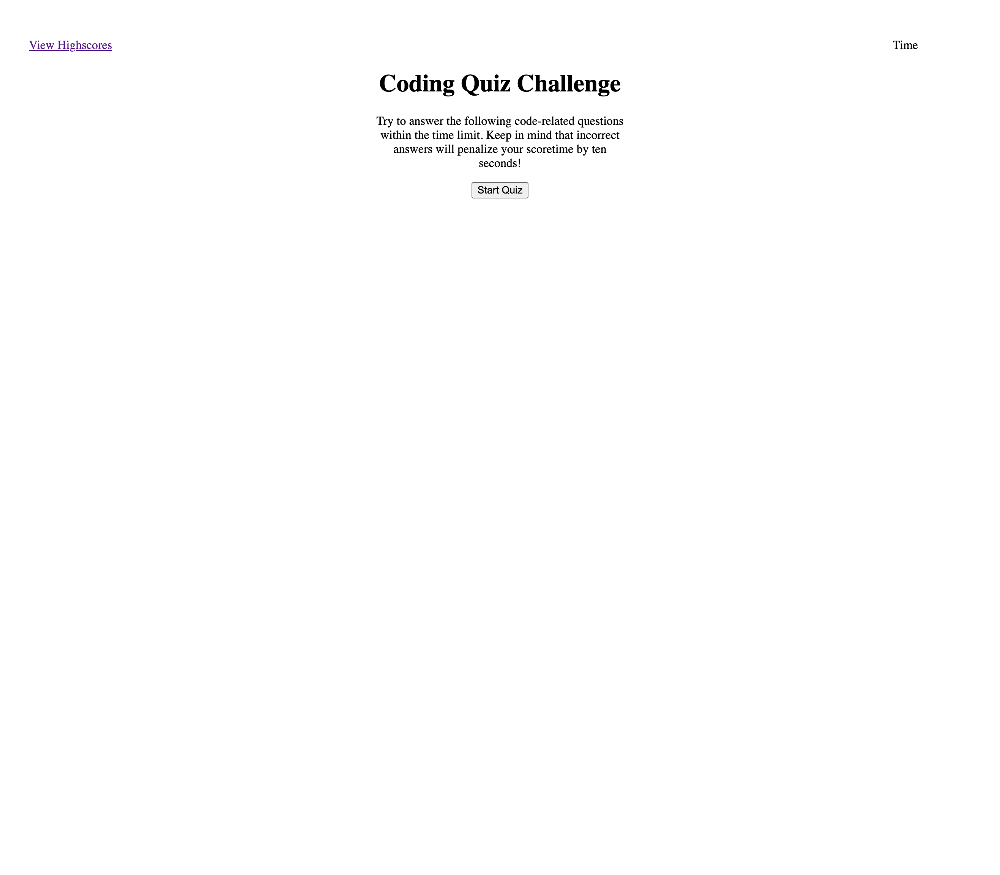

# Coding Quiz
[Link to deployed application](https://mathilde-01.github.io/coding-quiz/)

## Description
This application

## Installation
Below are the required steps to follow for this week's challenge using a AS AN / I WANT / SO THAT format for the user story and in a WHEN / THEN format for the acceptance criteria.

## User Story
AS A coding boot camp student  
I WANT to take a timed quiz on JavaScript fundamentals that stores high scores  
SO THAT I can gauge my progress compared to my peers  

## Acceptance Criteria
GIVEN I am taking a code quiz  
WHEN I click the start button  
THEN a timer starts and I am presented with a question  
WHEN I answer a question  
THEN I am presented with another question  
WHEN I answer a question incorrectly  
THEN time is subtracted from the clock  
WHEN all questions are answered or the timer reaches 0  
THEN the game is over  
WHEN the game is over  
THEN I can save my initials and my score  

## Credits
[Bootcampspot.com](https://bootcampspot.instructure.com/courses/4347/assignments/62269?module_item_id=1081301)